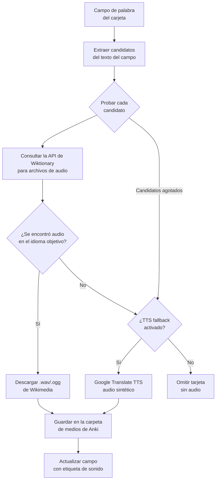

# Añadir Audio a Tarjetas

[English](README.md) | [日本語](README.ja.md)

Un complemento de Anki que añade automáticamente **audio nativo humano** a tus tarjetas descargando grabaciones de pronunciación de Wiktionary. Compatible con 12 idiomas. Sin clave de API. Completamente gratuito.

---

## Cómo funciona

Por cada tarjeta del mazo, el complemento busca la palabra en el Wiktionary en inglés, que alberga miles de grabaciones de la comunidad etiquetadas por idioma. Si se encuentra una grabación nativa, se descarga y se añade a la tarjeta. Si no, puede recurrir opcionalmente a Google Translate TTS.



### ¿Por qué Wiktionary?

Wiktionary alberga grabaciones reales de hablantes nativos, almacenadas en Wikimedia Commons bajo licencias libres. Cada idioma tiene su propio patrón de nomenclatura — por ejemplo, las grabaciones en español siguen `LL-Q1321 (spa)-Hablante-palabra.wav` — que el complemento usa para filtrar los resultados al idioma correcto.

### Idiomas soportados

La cobertura se basa en el número de grabaciones humanas nativas disponibles en Wikimedia Commons (datos del proyecto Lingua Libre, 2024).

| Idioma | Código | Grabaciones | Cobertura | Notas |
|---|---|---|---|---|
| Francés | `fr` | ~430 000 | Excelente | El idioma mejor cubierto con diferencia |
| Inglés | `en` | ~105 000 | Excelente | |
| Alemán | `de` | ~25 000 | Buena | |
| Ruso | `ru` | ~17 000 | Buena | |
| Árabe | `ar` | ~13 000 | Buena | |
| Italiano | `it` | ~12 000 | Buena | |
| Portugués | `pt` | ~8 000 | Moderada | |
| Español | `es` | ~5 000–10 000 | Moderada | ~40% en mazos de vocabulario típicos |
| Holandés | `nl` | ~1 800 | Limitada | ⚠ Se recomienda TTS de respaldo |
| Japonés | `ja` | ~1 000 | Limitada | ⚠ Se consulta ja.wiktionary.org primero |
| Coreano | `ko` | ~1 000 | Limitada | ⚠ Se consulta ko.wiktionary.org primero |
| Chino | `zh` | < 50 | Muy baja | ⚠ Casi sin grabaciones; TTS muy recomendado |

Para japonés, coreano y chino, el complemento consulta automáticamente el Wiktionary en el idioma nativo (ja/ko/zh.wiktionary.org) antes de recurrir al inglés, lo que mejora los resultados para esos idiomas. El diálogo muestra un aviso cuando se selecciona un idioma con baja cobertura.

---

## Características

- **Audio humano nativo** — grabaciones reales de Wiktionary, no voz sintetizada
- **Análisis inteligente de campos** — campos como `"floor piso planta"` o `"¿cuál?"` se dividen en candidatos; se prueba cada uno hasta encontrar audio
- **Dos campos de audio** — opcionalmente escribe el mismo audio tanto en la parte delantera como trasera de una tarjeta
- **TTS de respaldo opcional** — Google Translate TTS cubre los huecos cuando no existe grabación nativa
- **Control de velocidad de solicitudes** — las peticiones se espacian para no sobrecargar los servidores de Wikimedia
- **Interfaz multilingüe** — la interfaz del complemento se adapta al idioma de Anki: inglés, español o japonés

---

## Requisitos

- Anki 23.10 o posterior (probado en 25.09.2)
- Conexión a internet durante el procesamiento

---

## Instalación

1. Descarga **`AddAudioToCards.ankiaddon`** desde la página de [Releases](../../releases)
2. Abre Anki
3. Ve a **Herramientas → Complementos → Instalar desde archivo...**
4. Selecciona el archivo descargado
5. Reinicia Anki

El complemento aparece en **Herramientas → Añadir Audio a Tarjetas...**

---

## Uso

### 1. Abrir el diálogo

**Herramientas → Añadir Audio a Tarjetas...**


### 2. Configurar los campos

| Ajuste | Descripción |
|---|---|
| **Mazo** | El mazo a procesar |
| **Campo de palabra** | El campo que contiene la palabra o frase a buscar |
| **Campo de audio (1)** | El campo donde se escribirá la etiqueta `[sound:…]` |
| **Campo de audio (2)** | *(opcional)* Un segundo campo para recibir el mismo audio — útil para tarjetas que reproducen audio en ambas caras |
| **Idioma** | Idioma objetivo para la búsqueda de audio y el TTS de respaldo |

### 3. Opciones

| Opción | Descripción |
|---|---|
| **Sobreescribir audio existente** | Volver a buscar audio aunque el campo ya contenga una etiqueta de sonido |
| **Usar TTS como respaldo** | Si no existe grabación nativa en Wiktionary, generar audio con Google Translate TTS |

### 4. Hacer clic en "Añadir Audio"

Una barra de progreso muestra el estado del procesamiento. Al finalizar, aparece un resumen:

```
Completado — 777 tarjetas procesadas

  Audio nativo (Wiktionary): 312
  Saltadas (ya tienen audio): 0
  Sin audio encontrado: 465
```

Las tarjetas sin audio suelen ser campos en inglés, descripciones de varias palabras o palabras que aún no tienen grabación en Wiktionary.

---

## Cobertura de audio

La cobertura depende del contenido del campo de palabra:

| Contenido del campo | Ejemplo | Resultado |
|---|---|---|
| Palabra en el idioma objetivo | `hablar` | ✅ Audio nativo |
| Varias palabras con objetivo | `floor piso planta` | ✅ Prueba `piso` tras fallar `floor` |
| Frase con objetivo | `de la mañana` | ✅ Prueba `mañana` |
| Palabra con puntuación | `¿cuál?` | ✅ Se limpia a `cuál` |
| Palabra en idioma incorrecto | `Monday` (con español seleccionado) | ❌ Sin grabación en ese idioma |
| Descripción pura | `that person informal/formal` | ❌ Sin coincidencia |

---

## Compilar desde el código fuente

El directorio `addon/` contiene el código fuente del complemento. Para empaquetarlo:

```bash
python build.py
# → AddAudioToCards.ankiaddon
```

O manualmente:

```bash
cd addon
zip -r ../AddAudioToCards.ankiaddon .
```

En Windows (PowerShell):

```powershell
Compress-Archive -Path addon\* -DestinationPath AddAudioToCards.zip
Rename-Item AddAudioToCards.zip AddAudioToCards.ankiaddon
```

### Estructura del proyecto

```
AddAudioToCardOfAnki/
├── addon/
│   ├── __init__.py        # Registra el elemento del menú Herramientas
│   ├── audio_fetcher.py   # Búsqueda en Wiktionary + respaldo Google TTS
│   ├── dialog.py          # Diálogo de interfaz Qt
│   ├── i18n.py            # Traducciones (EN / ES / JA)
│   ├── manifest.json      # Metadatos del complemento de Anki
│   └── config.json        # Configuración predeterminada
├── build.py               # Script de empaquetado
└── README.md
```

### Añadir un nuevo idioma de interfaz

Abre `addon/i18n.py` y añade tu código de idioma a cada entrada del diccionario `_T`:

```python
"btn_add": {
    "en": "Add Audio",
    "es": "Añadir Audio",
    "ja": "音声を追加",
    "fr": "Ajouter l'audio",   # ← añadir aquí
},
```

Luego añade el código al bloque de comprobación en `_detect_lang()`.

---

## Notas técnicas

### Control de velocidad de solicitudes

Wiktionary y Wikimedia Commons tienen límites de velocidad independientes:

- **API de Wiktionary** (`en.wiktionary.org`) — 1 solicitud cada 250 ms
- **Descargas de audio** (`upload.wikimedia.org`) — 1 solicitud por segundo

El complemento aplica ambos límites automáticamente. Procesar un mazo grande lleva más tiempo, pero evita errores HTTP 429 y mantiene las solicitudes dentro de los límites aceptables.

### Nomenclatura de archivos

Los archivos de audio descargados se guardan en la carpeta de medios de Anki con el siguiente esquema de nombres:

```
audio_{lang}_{word}.{ogg|mp3}
```

Por ejemplo: `audio_es_hablar.ogg`

### Sin dependencias externas

El complemento usa únicamente la biblioteca estándar de Python (`urllib`, `ssl`, `json`, `threading`) — no se necesita `pip install`. Funciona con el Python incluido en Anki sin configuración adicional.

---

## Licencia

MIT
