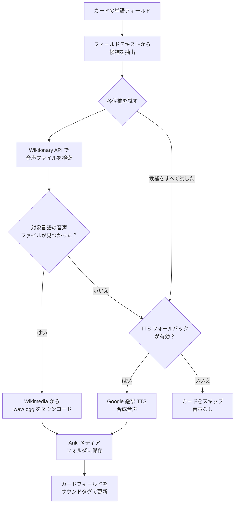

# カードに音声を追加

[English](README.md) | [Español](README.es.md)

Wiktionary からネイティブ音声を取得して、Anki のフラッシュカードに自動的に追加するアドオンです。12言語に対応。API キー不要。完全無料。

---

## 仕組み

デッキ内の各カードについて、英語版 Wiktionary で単語を検索します。Wiktionary には言語別にタグ付けされたコミュニティ録音が数千件収録されています。ネイティブ録音が見つかれば、それをダウンロードしてカードに追加します。見つからない場合は、オプションで Google 翻訳 TTS にフォールバックできます。



### なぜ Wiktionary？

Wiktionary にはネイティブスピーカーが録音した音声が収録されており、Wikimedia Commons に保存されてフリーライセンスで公開されています。各言語には固有の命名パターンがあります（例：スペイン語は `LL-Q1321 (spa)-Speaker-word.wav`）。このアドオンはそのパターンを使って正しい言語の音声のみを取得します。

### 対応言語

録音数は Wikimedia Commons（Lingua Libre プロジェクトデータ、2024年）を基準にしています。

| 言語 | コード | 録音数 | カバレッジ | 備考 |
|---|---|---|---|---|
| フランス語 | `fr` | 約 430,000 | 非常に良い | 最も充実している言語 |
| 英語 | `en` | 約 105,000 | 非常に良い | |
| ドイツ語 | `de` | 約 25,000 | 良い | |
| ロシア語 | `ru` | 約 17,000 | 良い | |
| アラビア語 | `ar` | 約 13,000 | 良い | |
| イタリア語 | `it` | 約 12,000 | 良い | |
| ポルトガル語 | `pt` | 約 8,000 | 普通 | |
| スペイン語 | `es` | 約 5,000〜10,000 | 普通 | 一般的な単語デッキで約 40% |
| オランダ語 | `nl` | 約 1,800 | 限定的 | ⚠ TTS フォールバック推奨 |
| 日本語 | `ja` | 約 1,000 | 限定的 | ⚠ ja.wiktionary.org を優先検索 |
| 韓国語 | `ko` | 約 1,000 | 限定的 | ⚠ ko.wiktionary.org を優先検索 |
| 中国語 | `zh` | 50 未満 | 非常に低い | ⚠ 録音がほぼなし。TTS を強く推奨 |

日本語・韓国語・中国語については、英語版の前にそれぞれのネイティブ言語版 Wiktionary（ja/ko/zh.wiktionary.org）を自動的に検索するため、ヒット率が向上します。カバレッジが低い言語を選択した場合、ダイアログに警告が表示されます。

---

## 機能

- **ネイティブ音声** — 合成音声ではなく、Wiktionary のネイティブスピーカーによる実際の録音
- **スマートフィールド解析** — `"floor piso planta"` や `"cuál?"` のような複合フィールドを候補に分割し、音声が見つかるまで順に試します
- **2つの音声フィールド** — 表面と裏面の両方に同じ音声を書き込むことが可能
- **TTS フォールバック** — ネイティブ録音が存在しない場合、Google 翻訳 TTS で補完（任意）
- **レート制限** — Wikimedia のサーバーに負荷をかけないよう自動的にリクエスト間隔を調整
- **多言語 UI** — Anki の言語設定に合わせてインターフェースが切り替わります（英語・スペイン語・日本語）

---

## 動作要件

- Anki 23.10 以降（25.09.2 で動作確認済み）
- 処理中にインターネット接続が必要

---

## インストール

1. [リリース](../../releases)ページから **`AddAudioToCards.ankiaddon`** をダウンロード
2. Anki を開く
3. **ツール → アドオン → ファイルからインストール...** を選択
4. ダウンロードしたファイルを選択
5. Anki を再起動

アドオンは **ツール → カードに音声を追加...** から利用できます。

---

## 使い方

### 1. ダイアログを開く

**ツール → カードに音声を追加...**


### 2. フィールドを設定する

| 設定 | 説明 |
|---|---|
| **デッキ** | 処理対象のデッキ |
| **単語フィールド** | 検索する単語やフレーズが入っているフィールド |
| **音声フィールド (1)** | `[sound:…]` タグを書き込むフィールド |
| **音声フィールド (2)** | *(任意)* 同じ音声を受け取る2つ目のフィールド — 表裏両面で音声を再生するカードに便利 |
| **言語** | 音声検索と TTS フォールバックの対象言語 |

### 3. オプション

#### 既存の音声を上書き

チェックなし *(デフォルト)* の場合、音声フィールドにすでに `[sound:…]` タグがあるカードは完全にスキップされます。これにより再実行が高速かつ安全になります — まだ音声のないカードだけが処理されます。

チェックありの場合、すべてのカードを例外なく再取得します。古い TTS 録音を新しく追加されたネイティブ音声に置き換えたい場合や、壊れたファイルを修復したい場合に使用します。

> **ヒント：** 「上書き」が有効な場合でも、すでにディスクに保存されているファイルは再ダウンロードしません。Anki のメディアフォルダに存在するファイルはネットワークリクエストなしに即座に再利用されます。

#### TTS をフォールバックとして使用

Wiktionary にネイティブ録音が存在しない場合、および Wikimedia CDN がセッションのダウンロードを制限した場合の動作を制御します。

| TTS 設定 | ネイティブ録音なし | Wikimedia CDN がセッションをブロック |
|---|---|---|
| **オフ** *(デフォルト)* | カードは音声なしのまま | 処理が停止。完了済みのカードは保存される。1〜2時間後に再実行して続きを処理。 |
| **オン** | Google 翻訳 TTS を使用 | 残りのすべてのカードを自動的に TTS に切り替え。サマリーで切り替えポイントを表示。 |

**どちらを選ぶべきか？**

- **TTS オフ** — ネイティブ音声の品質が重要で、数日かけて複数回実行してもよい場合に最適。
- **TTS オン** — デッキ全体を一度に埋めたい場合に最適。スペイン語・フランス語・ドイツ語など主要言語の Google 翻訳 TTS は高品質で、語学学習に十分適しています。

### 4. 「音声を追加」をクリック

処理中はプログレスバーが表示されます。完了すると結果サマリーが表示されます：

```
完了 — 777 枚のカードを処理しました

  ネイティブ音声 (Wiktionary): 312
  Google TTS (合成音声):       200
  ディスクから再利用:            50
  スキップ (音声あり):            0
  音声なし: 215
```

#### CDN がセッションをブロックする理由

Wiktionary の音声ファイルはすべて Wikimedia Commons の `upload.wikimedia.org` でホストされており、セッションごとのダウンロード数制限が設けられています。1セッションで約 50〜150 件のダウンロードに成功すると、サーバーは HTTP 429 エラーを返し始め、リクエスト間隔に関わらずそれ以上のファイルを提供しなくなります。

これはアドオンのバグではなく、共有インフラを保護するための Wikimedia による意図的な制限です。アドオンはブロックを即座に検出し、TTS に切り替えるか、またはクリーンに停止します。これまでの作業は失われません。

**再実行の戦略（TTS オフの場合）：** ダウンロードに成功したファイルはディスクにキャッシュされるため、次回の実行は前回の続きから正確に再開されます。毎日 1 回実行するだけで、数日かけてデッキ全体を埋めることができます。

---

## 音声カバレッジ

カバレッジは単語フィールドの内容によって異なります：

| フィールドの内容 | 例 | 結果 |
|---|---|---|
| 対象言語の単語 | `hablar` | ✅ ネイティブ音声 |
| 対象言語を含む複合語 | `floor piso planta` | ✅ `floor` 失敗後に `piso` を試す |
| 対象言語を含むフレーズ | `de la mañana` | ✅ `mañana` を試す |
| 句読点付きの単語 | `¿cuál?` | ✅ `cuál` にクリーニング |
| 異なる言語の単語 | `Monday`（スペイン語選択時） | ❌ その言語の録音なし |
| 純粋な説明文 | `that person informal/formal` | ❌ マッチなし |

---

## ソースからビルド

`addon/` ディレクトリにアドオンのソースが含まれています。パッケージ化するには：

```bash
python build.py
# → AddAudioToCards.ankiaddon
```

または手動で：

```bash
cd addon
zip -r ../AddAudioToCards.ankiaddon .
```

Windows（PowerShell）の場合：

```powershell
Compress-Archive -Path addon\* -DestinationPath AddAudioToCards.zip
Rename-Item AddAudioToCards.zip AddAudioToCards.ankiaddon
```

### プロジェクト構成

```
AddAudioToCardOfAnki/
├── addon/
│   ├── __init__.py        # Tools メニュー項目を登録
│   ├── audio_fetcher.py   # Wiktionary 検索 + Google TTS フォールバック
│   ├── dialog.py          # Qt UI ダイアログ
│   ├── i18n.py            # 翻訳（EN / ES / JA）
│   ├── manifest.json      # Anki アドオンメタデータ
│   └── config.json        # デフォルト設定
├── build.py               # パッケージングスクリプト
└── README.md
```

### UI 言語を追加する

`addon/i18n.py` を開き、`_T` 辞書の各エントリに言語コードを追加します：

```python
"btn_add": {
    "en": "Add Audio",
    "es": "Añadir Audio",
    "ja": "音声を追加",
    "fr": "Ajouter l'audio",   # ← ここに追加
},
```

次に `_detect_lang()` のチェックにもコードを追加します。

---

## 技術的な注記

### レート制限

Wiktionary と Wikimedia Commons は独立したレート制限を持っています：

- **Wiktionary API**（`en.wiktionary.org`）— 250ms に 1 リクエスト
- **音声ダウンロード**（`upload.wikimedia.org`）— 1秒に 1 リクエスト

アドオンは両方の制限を自動的に適用します。大きなデッキの処理には時間がかかりますが、HTTP 429 エラーを防ぎ、サーバーへの負荷を最小限に抑えます。

### ファイル命名

ダウンロードした音声ファイルは、以下の命名規則で Anki のメディアフォルダに保存されます：

```
audio_{lang}_{word}.{ogg|mp3}
```

例：`audio_es_hablar.ogg`

### 外部依存なし

このアドオンは Python の標準ライブラリ（`urllib`、`ssl`、`json`、`threading`）のみを使用しています。`pip install` は不要で、Anki に同梱された Python でそのまま動作します。

---

## ライセンス

MIT
