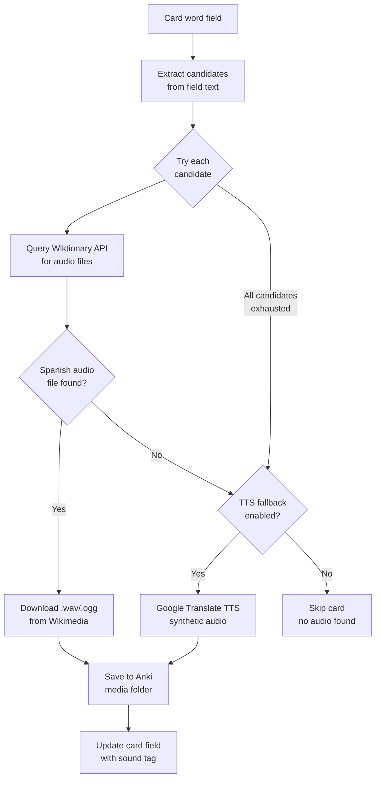
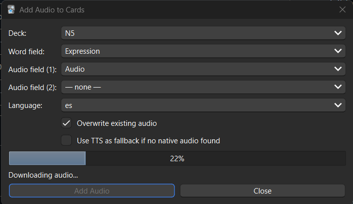

# Add Audio to Cards

An Anki add-on that automatically adds **native human audio** to your flashcards by fetching pronunciation recordings from Wiktionary. Supports 12 languages. No API key required. Completely free.

---

## How it works

For each card in your deck, the add-on looks up the word on the English Wiktionary, which hosts thousands of community-recorded pronunciations tagged by language. If a native recording is found, it is downloaded and added to the card. If not, it can optionally fall back to Google Translate TTS.



### Why Wiktionary?

Wiktionary hosts real recordings made by native speakers, stored on Wikimedia Commons and freely licensed. Each language has its own naming pattern — for example, Spanish recordings follow `LL-Q1321 (spa)-Speaker-word.wav` — which the add-on uses to filter results to the correct language.

### Supported languages

| Language | Code | Coverage |
|---|---|---|
| Arabic | `ar` | Moderate |
| Chinese | `zh` | Good |
| Dutch | `nl` | Good |
| English | `en` | Excellent |
| French | `fr` | Excellent |
| German | `de` | Excellent |
| Italian | `it` | Good |
| Japanese | `ja` | Good |
| Korean | `ko` | Moderate |
| Portuguese | `pt` | Good |
| Russian | `ru` | Good |
| Spanish | `es` | Excellent |

Coverage for common vocabulary in well-resourced languages (EN, ES, FR, DE) is ~100%. Less common words or less-resourced languages may not have recordings yet.

---

## Features

- **Native human audio** — real recordings from Wiktionary, not synthesised speech
- **Smart field parsing** — fields like `"floor piso planta"` or `"cuál?"` are split into candidates; each is tried until audio is found
- **Two audio fields** — optionally write the same audio to both the front and back of a card
- **Optional TTS fallback** — Google Translate TTS fills gaps when no native recording exists
- **Respectful rate limiting** — requests are spaced to avoid overloading Wikimedia's servers
- **Multilingual UI** — the add-on interface adapts to Anki's language: English, Spanish, or Japanese

---

## Requirements

- Anki 23.10 or later (tested on 25.09.2)
- Internet connection during processing

---

## Installation

1. Download **`AddAudioToCards.ankiaddon`** from the [Releases](../../releases) page
2. Open Anki
3. Go to **Tools → Add-ons → Install from file...**
4. Select the downloaded file
5. Restart Anki

The add-on appears under **Tools → Add Audio to Cards...**

---

## Usage

### 1. Open the dialog

**Tools → Add Audio to Cards...**



### 2. Configure the fields

| Setting | Description |
|---|---|
| **Deck** | The deck to process |
| **Word field** | The field containing the word or phrase to look up |
| **Audio field (1)** | The field where the `[sound:…]` tag will be written |
| **Audio field (2)** | *(optional)* A second field to receive the same audio — useful for cards that play audio on both sides |
| **Language** | Target language for audio lookup and TTS fallback |

### 3. Options

| Option | Description |
|---|---|
| **Overwrite existing audio** | Re-fetch audio even if the field already contains a sound tag |
| **Use TTS as fallback** | If no native Wiktionary recording exists, generate audio with Google Translate TTS |

### 4. Click "Add Audio"

A progress bar shows the processing status. When done, a summary appears:

```
Done — 777 cards processed

  Native audio (Wiktionary): 312
  Skipped (already have audio): 0
  No audio found: 465
```

Cards with no audio found are typically English-language field values, multi-word descriptions, or words not yet recorded on Wiktionary.

---

## Audio coverage

Coverage depends on what is in your word field:

| Field content | Example | Result |
|---|---|---|
| Single word (target language) | `hablar` | ✅ Native audio |
| Multi-word with target | `floor piso planta` | ✅ Tries `piso` after `floor` fails |
| Phrase with target | `de la mañana` | ✅ Tries `mañana` |
| Word with punctuation | `¿cuál?` | ✅ Cleaned to `cuál` |
| Word in wrong language | `Monday` (with Spanish selected) | ❌ No recording in that language |
| Pure description | `that person informal/formal` | ❌ No match |

---

## Building from source

The `addon/` directory contains the add-on source. To package it:

```bash
python build.py
# → AddAudioToCards.ankiaddon
```

Or manually:

```bash
cd addon
zip -r ../AddAudioToCards.ankiaddon .
```

On Windows (PowerShell):

```powershell
Compress-Archive -Path addon\* -DestinationPath AddAudioToCards.zip
Rename-Item AddAudioToCards.zip AddAudioToCards.ankiaddon
```

### Project structure

```
AddAudioToCardOfAnki/
├── addon/
│   ├── __init__.py        # Registers the Tools menu item
│   ├── audio_fetcher.py   # Wiktionary lookup + Google TTS fallback
│   ├── dialog.py          # Qt UI dialog
│   ├── i18n.py            # Translations (EN / ES / JA)
│   ├── manifest.json      # Anki add-on metadata
│   └── config.json        # Default configuration
├── build.py               # Packaging script
└── README.md
```

### Adding a new UI language

Open `addon/i18n.py` and add your language code to each entry in the `_T` dictionary:

```python
"btn_add": {
    "en": "Add Audio",
    "es": "Añadir Audio",
    "ja": "音声を追加",
    "fr": "Ajouter l'audio",   # ← add here
},
```

Then add the code to the check in `_detect_lang()`.

---

## Technical notes

### Rate limiting

Wiktionary and Wikimedia Commons have separate rate limits:

- **Wiktionary API** (`en.wiktionary.org`) — 1 request per 250 ms
- **Audio downloads** (`upload.wikimedia.org`) — 1 request per 1 second

The add-on enforces both limits automatically. Processing a large deck takes longer as a result, but this avoids HTTP 429 errors and keeps the requests polite.

### File naming

Downloaded audio files are saved to Anki's media folder with the naming scheme:

```
audio_{lang}_{word}.{ogg|mp3}
```

For example: `audio_es_hablar.ogg`

### No external dependencies

The add-on uses only Python's standard library (`urllib`, `ssl`, `json`, `threading`) — no `pip install` needed. It works with Anki's bundled Python out of the box.

---

## License

MIT
